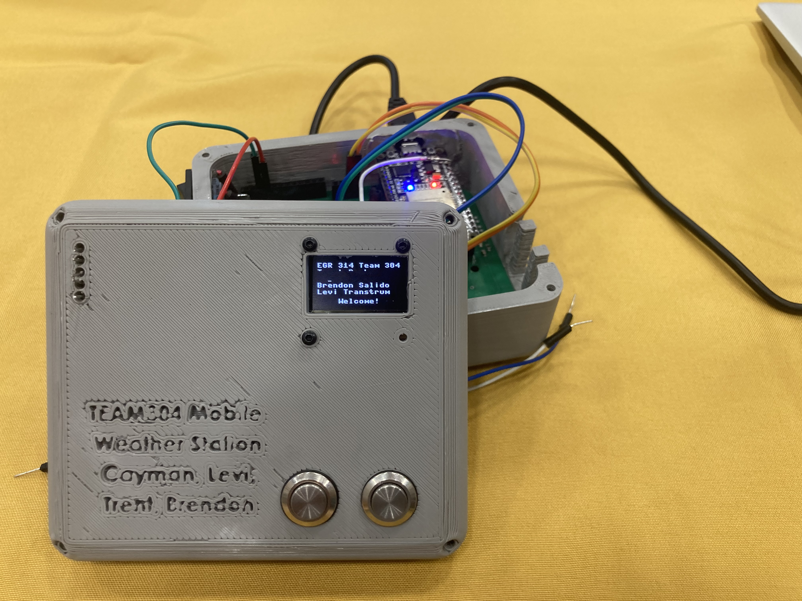
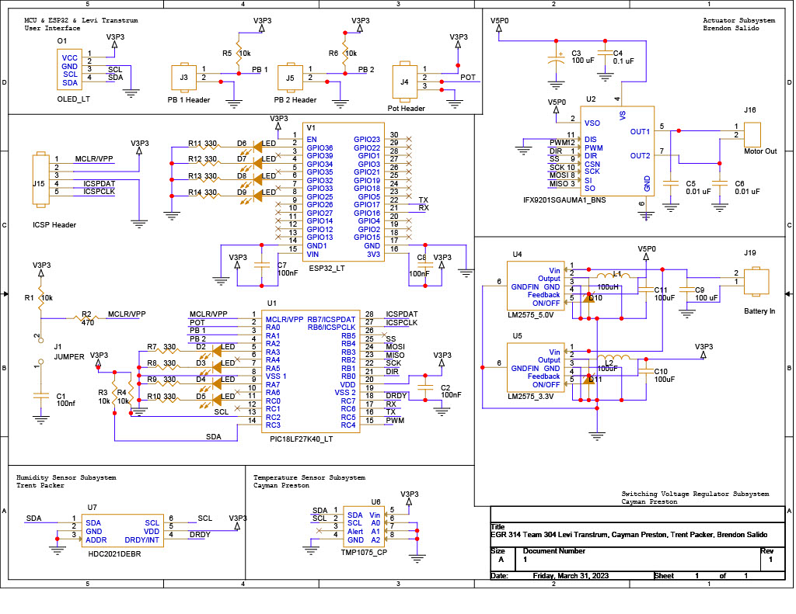
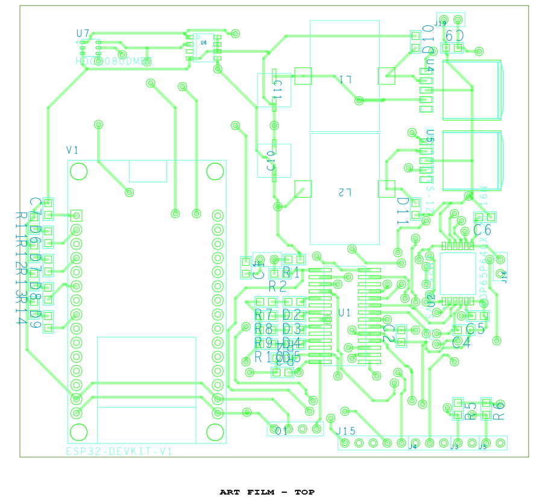
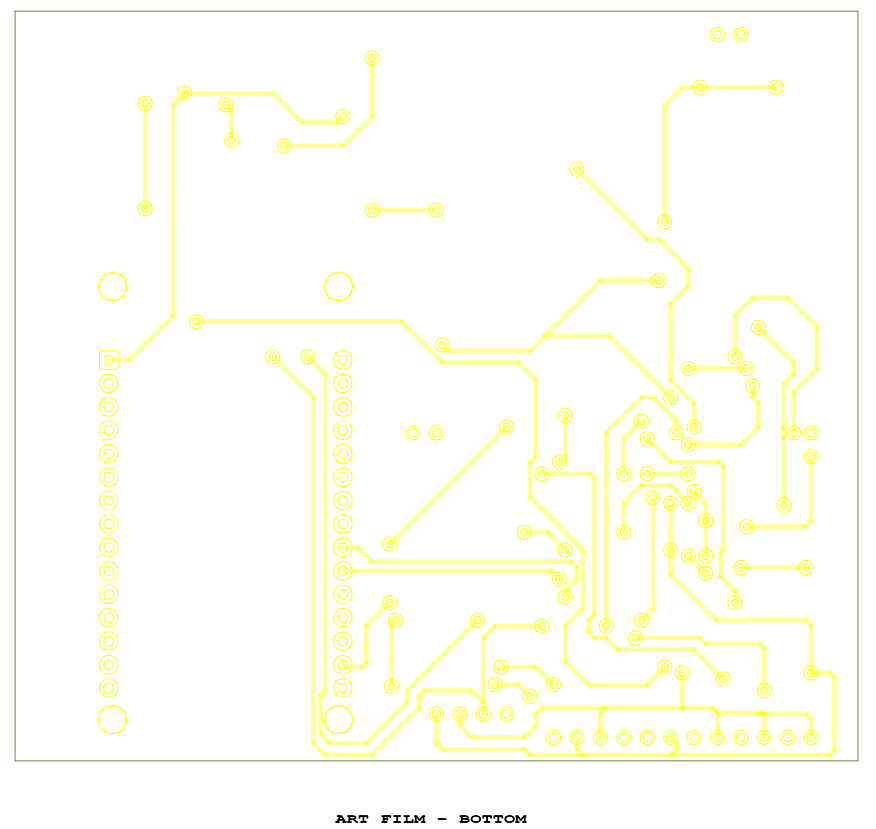
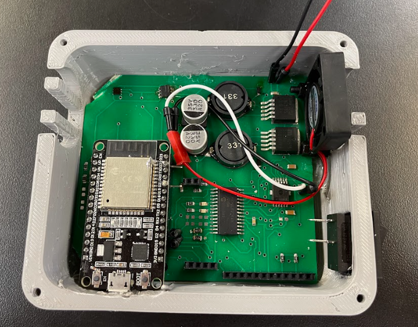
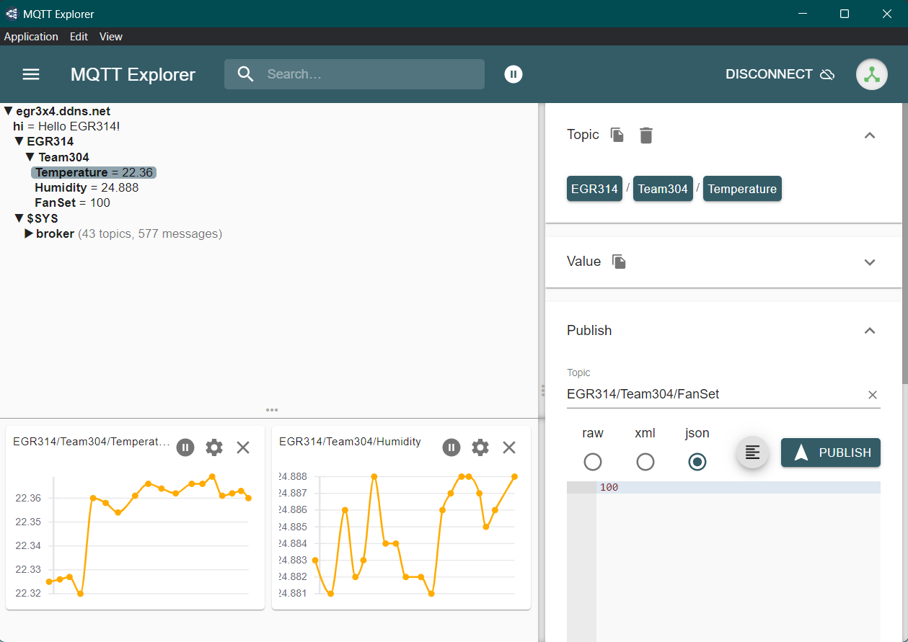
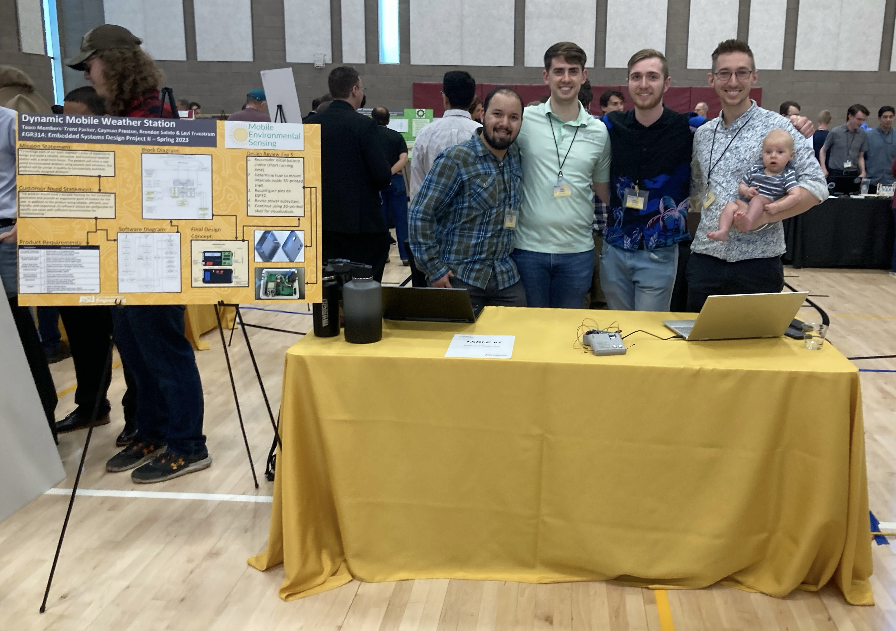

# IoT Weather Station

For my embedded systems class this semester, my team and I designed, built, and programmed an IoT Weather Station from the ground up.



Course requirements dictated that the project feature the following:

* A PIC microcontroller
* 2 serial sensors
* A controllable actuator
* A switching voltage regulator
* Wireless connectivity
* A user input interface with program interrupts

To meet the requirements, my team selected the following hardware:

* [Microchip PIC18LF27K40 Microcontroller](https://www.microchip.com/en-us/product/PIC18F27K40)
* [Texas Instruments HDC2021DEBR Humidity Sensor](https://www.digikey.com/en/products/detail/texas-instruments/HDC2021DEBR/12762163)
* [Texas Instruments TMP1075 Temperature Sensor](https://www.ti.com/product/TMP1075)
* [Infineon Technologies IFX9201SGAUMA1 Motor Driver](https://www.mouser.com/ProductDetail/Infineon-Technologies/IFX9201SGAUMA1?qs=CVaTMblcXggE9XQ1VnAvKA%3D%3D)
* [Adafruit 8mm Axial Fan](https://www.digikey.com/en/products/detail/adafruit-industries-llc/3368/6680553)
* [Universal Solder Electronics 128x64 OLED display](https://www.digikey.com/en/products/detail/universal-solder-electronics-ltd/OLED-128x64-1-3-I2C/16822118)
* [Texas Instruments LM2575 Switching Voltage Regulator](https://www.ti.com/lit/ds/symlink/lm2575.pdf?ts=1683548483310&ref_url=https%253A%252F%252Fwww.google.com%252F)
* [Expressif ESP32](https://www.digikey.com/en/products/detail/espressif-systems/ESP32-DEVKITC-VIE/12091811)

After selecting components, we went on to create the electrical schematic and PCB design using [Cadence](https://www.cadence.com/en_US/home/tools/pcb-design-and-analysis.html). The license to use this heavyweight industrial software was provided by Arizona State University.

<p style="text-align: center;">
Electrical Schematic in Cadence OrCAD Capture CIS
</p>



<p style="text-align: center;">
Top Layer PCB Design in Cadence Allegro PCB Editor
</p>



<p style="text-align: center;">
Bottom Layer PCB Design in Cadence Allegro PCB Editor
</p>



While not part of the course requirements, our team wanted to make our project visually appealing. We created a SolidWorks model and 3D printed the housing for our board.

<p style="text-align: center;">
Enclosure SolidWorks model
</p>

.png)

We ordered the board to be printed by [JLC](https://jlcpcb.com/). The board came back beautiful - much nicer than the PCBs I've had manufactured in-house at ASU's Peralta Lab. However, if we could go back and redo it, I would have spent the extra $10 for a [stencil](https://support.jlcpcb.com/article/25-how-to-order-a-stencil). These make PCB assembly an absolute breeze, and you end up with perfectly placed components. As was the case, we had to settle for placing components manually and baking them in the oven, resulting in a few components that needed additional attention.

<p style="text-align: center;">
Final assembled PCB in its 3D printed housing
</p>



Finally, with fully assembled hardware, it was time to begin programming. Our PIC microcontroller served as the central hub for all operations, while the ESP32 was only there for Wi-Fi connectivity. Doing things this way is a little like driving your Honda Accord every day while the Lamborghini sits in the garage. But one of the main purposes of the course was to gain familiarity with lower-level, less Arduino-like MCUs.

I used Microchip's MPLAB X IDE along with MCC Classic and the XC8 Compiler to program the PIC in C++. While it took some getting used to, the MCC interface is actually fantastic for setting up peripherals and making pin assignments, and the included header files and makefiles are brilliantly simple to use.

I implemented chip-to-chip communication on our board using I²C and UART. While different in their mechanisms and capabilities, both are effective at transferring arbitrarily wide data types using only two wires.

The temperature and humidity sensors use the I²C protocol. This protocol uses two lines, a clock and a data line. The clock line transmits a steady signal which is used for timing the data pulses. The data line initiates all communication, and sends information as a stream of 1s and 0s, each having the duration of one clock pulse. I²C communication is bi-directional, but only half-duplex, meaning data cannot be sent in both directions simultaneously. Therefore, it operates in a sort of request and response method. The I²C Master, in this case, the PIC microcontroller, first sends out the address of the target device. It then issues a command, to which the target device responds. Here is the code for implementing this in our system using the software stack described above.

``` C++
I2C1_Initialize();

uint8_t temp_sensor_address = 0b1000000;
uint8_t temp_register_lower = 0x00;
uint8_t temp_register_upper = 0x01;

//Set the sensor to continuous measurement mode
I2C1_Write1ByteRegister(temp_sensor_address, device_config_register, device_config_setting);
I2C1_Write1ByteRegister(temp_sensor_address, device_command_register, measure_command);

// Read from the temperature sensor
temp_raw_1 = I2C1_Read1ByteRegister(temp_sensor_address, temp_register_lower);
temp_raw_2 = I2C1_Read1ByteRegister(temp_sensor_address, temp_register_upper); 
temp_raw = temp_raw_2 << 8 | temp_raw_1;
temp = (((float) temp_raw)/(65536.0))*165.0 - 40.0;
```

The TMP1075 has 2-byte precision on its temperature readings, so the raw temperature reading is on a scale between 0 and 65535. This has to be converted to Celsius. Humidity readings were received through the same process.

For the communication between the PIC and the ESP32, we used UART. UART is a simple serial communication protocol which uses two lines, transmit and receive, to both send and receive data at a predetermined baud rate. The baud rate must be synchronized between the two devices or the data will be distorted during transmission.

We used UART to transmit temperature and humidity readings up to the ESP32, then from the ESP32 to an MQTT server over Wi-Fi. MPLABX has a handy feature that redirects STDIO to UART, so a simple ```printf``` statement handled UART transmission on the PIC side. The ESP32 code was more involved.

``` python
# Derived from: 
# * https://github.com/peterhinch/micropython-async/blob/master/v3/as_demos/auart.py
# * https://github.com/tve/mqboard/blob/master/mqtt_async/hello-world.py


from mqtt_async import MQTTClient, config
import uasyncio as asyncio
import time
from machine import UART
from machine import Pin
import my_oled
import logging
logging.basicConfig(level=logging.DEBUG)

MAXTX = 4

# Change the following configs to suit your environment
TOPIC_PUB_TEMP = 'EGR314/Team304/Temperature'
TOPIC_PUB_HUM = 'EGR314/Team304/Humidity'
TOPIC_PUB_MENU = 'EGR314/Team304/Menu'
TOPIC_PUB_FAN = 'EGR314/Team304/FanSpeed'

TOPIC_SUB = 'EGR314/Team304/FanSet'
MENU = 1
config.server = 'egr3x4.ddns.net' # can also be a hostname
config.ssid     = 'Levi'
config.wifi_pw  = 'FunkyFresh'

uart = UART(2, 9600,tx=16,rx=17)
uart.init(9600, bits=8, parity=None, stop=1,flow=0) # init with given parameters
led = Pin(2,Pin.OUT)

async def receiver():
    global MENU
    b = b''
    temp = 0
    hum = 0
    sreader = asyncio.StreamReader(uart)
    while True:
        res = await sreader.read(1)      
        if res==b't': # If you get a temperature reading...
            await client.publish(TOPIC_PUB_TEMP, b, qos=1) #Publish it
            temp = b
            b = b''
        elif res==b'h': # If you get a humidity reading...
            await client.publish(TOPIC_PUB_HUM, b, qos=1)
            hum = b
            b = b''
        elif res==b'm': # If you get a menu reading...
            await client.publish(TOPIC_PUB_MENU, b, qos=1)
            MENU = b
            b = b''
        elif res==b'f': # If you get a fan reading...
            await client.publish(TOPIC_PUB_FAN, b, qos=1)
            #print('published', b)
            b = b''
        elif res==b'w': # If you get a welcome screen command...
            my_oled.print_welcome_screen()
            b = b''        
        else:
            b+=res
            
        if MENU == b'1':
            my_oled.print_welcome_screen()
        else:
            my_oled.print_sensor_data(temp, hum) # Print it    


def callback(topic, msg, retained, qos):
    print('callback',topic, msg, retained, qos)
    while (msg):
        msg = msg.decode()
        msg = int(msg)
        msg = bytearray([msg])
        uart.write(msg)
        time.sleep(.01)
        msg = 0
        
        # toggle the onboard LED
        led.value(led.value()^1)

    # uart.write('\r\n')
    time.sleep(.01)
  
async def conn_callback(client): await client.subscribe(TOPIC_SUB, 1)

async def main(client):
    await client.connect()
    asyncio.create_task(receiver())
    while True:
        await asyncio.sleep(1)

config.subs_cb = callback
config.connect_coro = conn_callback

client = MQTTClient(config)
loop = asyncio.get_event_loop()
loop.run_until_complete(main(client))
```

The above code handles the Wi-Fi connection, UART recieve/transmit, and sub/pub to the MQTT server. Code for the OLED display was in another module: 

```python
from machine import Pin, SoftI2C
import ssd1306
import gfx
from time import sleep

i2c = SoftI2C(scl=Pin(22), sda=Pin(21))

oled_width = 128
oled_height = 64
oled = ssd1306.SSD1306_I2C(oled_width, oled_height, i2c)
graphics = gfx.GFX(oled_width, oled_height, oled.pixel)

def print_welcome_screen():
    oled.fill(0)
    oled.text("EGR 314 Team 304", 0, 0)
    oled.text("Trent Packer",0,10)
    oled.text("Cayman Preston",0,20)
    oled.text("Brendon Salido",0,30)
    oled.text("Levi Transtrum",0,40)
    oled.text("Welcome!", 32, 54)
    oled.show()

    
def print_data(msg, x):
    print("print_data was called")
    my_string = msg.decode('utf-8') # or my_string = str(msg, 'utf-8')
    my_strings = my_string.split(" ")
    my_values = [float(item) for item in my_strings]
    oled.fill(0)
    for ii, item in enumerate(my_values):
        oled.text(str(item), x, 10*ii)
    oled.show()
    pass

def print_sensor_data(temp, hum):
    oled.fill(0)
    oled.text("EGR 314 Team 304", 0, 0)
    
    oled.text("Temp:", 0, 20)
    oled.text(str(temp), 64, 20)
    oled.text("C", 118, 20)

    oled.text("RH:", 0, 30)
    oled.text(str(hum), 64, 30)
    oled.text("%", 118, 30)
    oled.show()
    pass

def plot_data(msg):
    print("plot_data was called")
    my_string = msg.decode('utf-8') # or my_string = str(msg, 'utf-8')
    my_strings = my_string.split(" ")
    my_values = [float(item) for item in my_strings]
    max_val = max(my_values)
    
    oled.fill(0)
    oled.text(str(max(my_values)), 64, 0)
    oled.text(str(min(my_values)), 64, 54)
    
    for i in range(len(my_values)-1):
        i+=1
        graphics.line((i-1)*128//(len(my_values)-1), 64-int(64*my_values[i-1]/max_val), i*128//(len(my_values)-1), 64-int(64*my_values[i]/max_val), 1)
        oled.show()
```

The OLED graphics were handled by the ssd1306 library. The result was pretty cool to see: a dynamically changing readout of the most recent temperature and humidity readings. The readings were also published to MQTT and could be viewed from anywhere in the world (with a Wi-Fi connection).

<p style="text-align: center;">
MQTT server messages
</p>



With the programs written and deployed to their respective chips, we had a fully functional board to present at the ASU Innovation Showcase! My wife brought our newborn son to take part in the celebration. He's the smaller gentleman on the right.

<p style="text-align: center;">
ASU Innovation Showcase
</p>



We had visitors at our table ranging from interested hobbysits to representatives from Microchip, and even some top executives from [ZEVX](https://zevx.com/)! It was inspiring to shake hands with people with such incredible levels of experience, who understood immediately the concepts we had spent all semester developing.

While this course was a huge learning curve for me, by the end I felt very comfortable and confident in the material and was a resource for helping others. I have a feeling this won't be my last PCB.