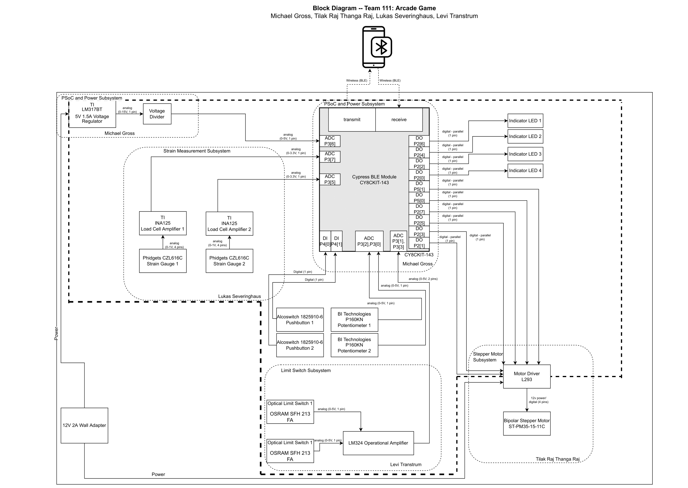
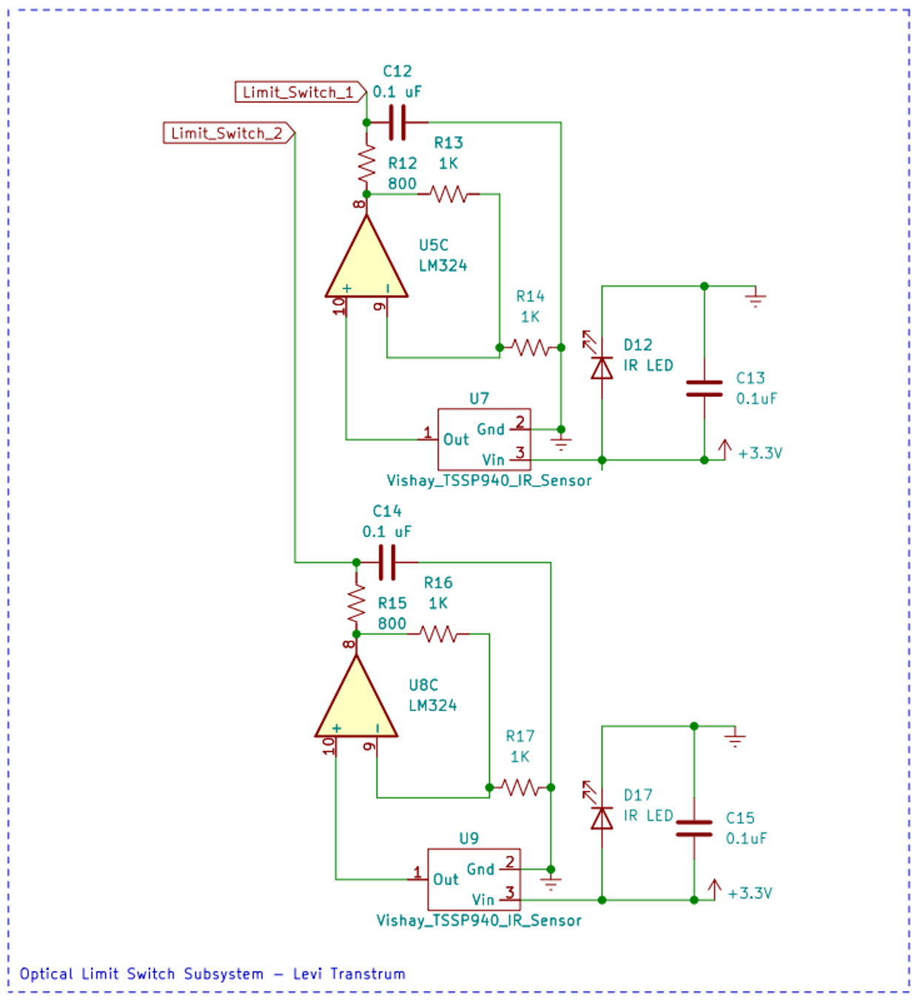
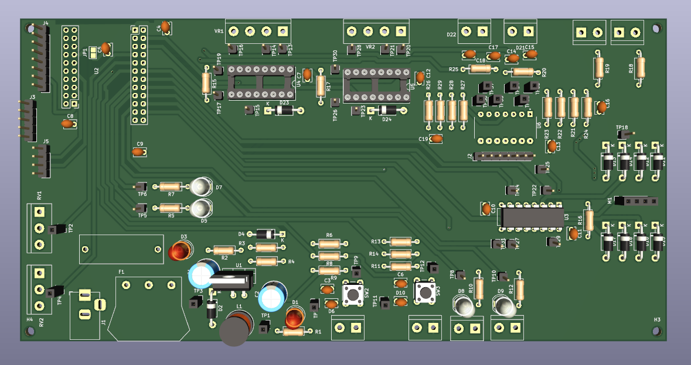
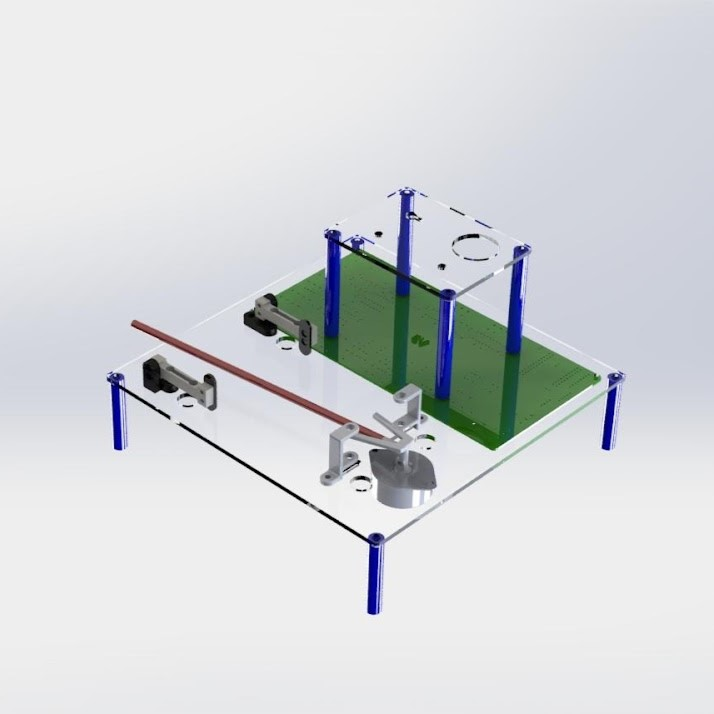
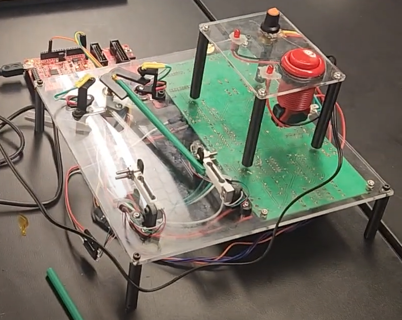
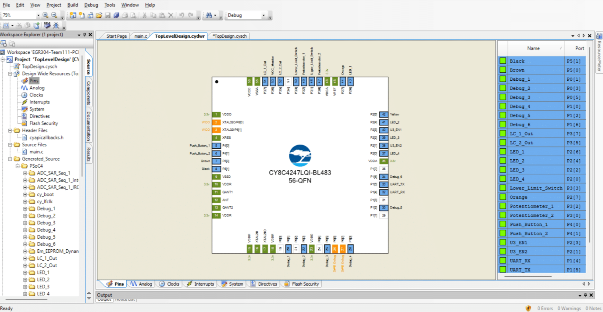
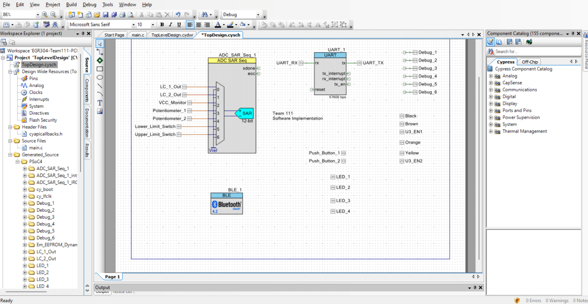

# Materials Test Rig

<iframe width="560" height="315" src="https://www.youtube.com/embed/rs_C8sR2_co" title="YouTube video player" frameborder="0" allow="accelerometer; autoplay; clipboard-write; encrypted-media; gyroscope; picture-in-picture; web-share" allowfullscreen></iframe>

In my Introduction to Embedded Systems course at ASU, my team and I designed, built, and programmed a materials test rig from the ground up.
The theme of the project was centered around [Dr. Dan Aukes'](https://danaukes.com/) research on [SCRAM robotics](https://www.nsf.gov/awardsearch/showAward?AWD_ID=1935324&HistoricalAwards=false) - Soft, Curved, Reconfigurable and/or Anisotropic Mechanisms. Dr. Aukes asked for an interactive science museum exhibit that would allow children to experiment with the properties of anisotropic materials and structures.

Anisotropic is defined as "having a physical property that has a different value when measured in different directions". Our team decided to create a device that would test the stiffness of user-created structure in opposite different directions, then determine whether or not the structure was anisotropic.

The central focus of the course was on the design, fabrication, assembly, and programming of a custom PCB. We were required to create a system with a linear voltage regulator, two analog sensors, a motor controller, and a microcontroller. We broke down the required functionality into a block diagram and assigned subsystems.



We chose to use a stepper motor to move the user-created structure against two separate strain gauges to measure the force it imparted before buckling. Two IR emitter/photodiode pairs served as limit switches to detect when the motor had reached the edge of its motion. We used LM324s as the op amps for all analog sensors. A PSoC CY8CKIT served as the microcontroller for the board.


The limit switch subsystem was particularly interesting as it used a transimpedance amplifier, which we had never seen nor heard of before. IR photodiodes produce a change in *current* in response to stimuli as opposed to a change in  *voltage* (like most simple analog sensors). This integrates fine with some systems, but we planned to leverage the PSoC's analog-to-digital converter (ADC) to read our signals. Hence, we had to find some way to convert the current produced by the IR photodiode into a voltage. This is the texbook application for a TIA.



Our PCB design was done using [KiCAD](https://www.kicad.org/), a powerful open source electrical schematic and PCB design tool. One of its flashiest features is the ability to produce a 3D modeled preview of your assembled board, right from the PCB editor.



Of course, since our board was designed to produce and measure physical forces on the macro scale, not just electrical inputs and outputs, we needed a mechanical design as well. We brought this SolidWorks model to life with laser-cut acrylic and 3D printed plastic from ASU's own Peralta Lab.



The board as well was fabricated in-house at Peralta Lab. The hardware came together quite nicely:



Now that we had the physical product assembled, it came time to work on the best part of any hardware - the software! We used Infineon's [PSoC Creator](https://www.infineon.com/cms/en/design-support/tools/sdk/psoc-software/psoc-creator/) 4.4 to program the PSoC.





```C
/* ========================================
*
* EGR304 Team 111 Project Source Code
* Final Revision 12/1/22
*
* ========================================
*/
#include "project.h"
#include <stdbool.h>
#include <stdio.h>
/***Function Prototypes**/
void calibrate_load_cells(void);
bool upper_limit_check(void);
bool lower_limit_check(void);
bool start_button_pressed(void);
bool mode_button_pressed(void);
void step(char);
void run(bool);
float get_adc_chan_volt(int);
float get_supply_voltage(void);
void calibrate_load_cells(void);
float get_load_cell(int);
void motor_test(void);
void print_adc_volt(int);
void print_status(void);
int max(int, int);
void display_results(int, int);
void display_int(char *, int);
void game();
void self_test();
int main();
/******Constansts ***/
// Which load cell is the top or bottom one
// "Top" is CCW, "Bottom" is CW
#define LC_UP 2
#define LC_DOWN 1
// ADC reference voltage
#define AREF 5.0f
// Voltage divider resistors, both divided by 1000.
#define VCC_R1 10
#define VCC_R2 3.8
// Start button pin read function
// Change this to change which button is read as the start button
#define START_BUTTON_READ Push_Button_1_Read
/***Global Variable***/
// Offset voltages for the load cells, set during calibration.
float load_cell_1_offset = 0;
float load_cell_2_offset = 0;
/*
Reads an ADC channel and returns the value as a voltage
Arguments: channel: integer ADC channel (0-6)
Returns: float voltage, ranging from 0-AREF.
*/
float get_adc_chan_volt(int channel){
// Acquire raw ADC value
int16 raw_val = ADC_SAR_Seq_1_GetResult16(channel);
// Convert to voltage, given a known AREF voltage
return ADC_SAR_Seq_1_CountsTo_Volts(channel, raw_val);
}
/*
Checks if the upper limit switch beam has been broken
Returns: true if beam is broken, false otherwise
*/
bool upper_limit_check()
{
LED_3_Write((get_adc_chan_volt(6) < 2) ? 1 : 0);
return get_adc_chan_volt(6) < 2;
}
/*
Checks if the lower limit switch beam has been broken
Returns: true if beam is broken, false otherwise
*/
bool lower_limit_check()
{
LED_4_Write((get_adc_chan_volt(5) < 2) ? 1 : 0);
return get_adc_chan_volt(5) < 2;
}
/*
Checks if the start button is pressed.
The button is set by a macro.
Returns: true if the button is pressed, false otherwise.
*/
bool start_button_pressed()
{
LED_1_Write((START_BUTTON_READ() == 0) ? 1 : 0);
return START_BUTTON_READ() == 0;
}
/*
Checks if the button 2 is pressed.
Returns: true if the button is pressed, false otherwise.
*/
bool mode_button_pressed()
{
LED_2_Write((Push_Button_2_Read() == 0) ? 1 : 0);
return Push_Button_2_Read() == 0;
}
/*
Sets all the motor pins to a given state. The bottom 4 bits of the
input set the state of each output pin.
Arguments: states: (char) pin states, only the lower 4 bits are in
use.
Returns: nothing
*/
void step(char states){
Motor_Black_Write((int) (states & 0b1000)>>3);
CyDelay(5);
Motor_Orange_Write((int) (states & 0b0100)>>2);
CyDelay(5);
Motor_Brown_Write((int) (states & 0b0010)>>1);
CyDelay(5);
Motor_Yellow_Write((int) (states & 0b0001)>0);
CyDelay(5);
}
/*
Moves the motor one step in a given direction.
Arguments: direction: (bool) true is CCW, false is CW
Returns: nothing
*/
void run(bool direction)
{ /*Move motor*/
if(direction)
{
/*CCW/Up*/
/*Step1*/
step(0b0011);
/*Step2*/
step(0b0110);
/*Step3*/
step(0b1100);
/*Step4*/
step(0b1001);
/*Coil power down*/
step(0b0000);
}
if(!direction)
{
/*CW/Down*/
/*Step1*/
step(0b1001);
/*Step2*/
step(0b1100);
/*Step3*/
step(0b0110);
/*Step4*/
step(0b0011);
/*Coil power down*/
step(0b0000);
}
}
/*
Calculates the board's 12V supply voltage, using the VCC monitor
voltage divider
Returns: float voltage
*/
float get_supply_voltage(){
float output_voltage = get_adc_chan_volt(2);
float supply_voltage = (float) output_voltage * (VCC_R1 + VCC_R2)
/ VCC_R2;
return supply_voltage;
}
/*
Calibrates the load cells, by zeroing them out.
Returns: nothing.
*/
void calibrate_load_cells(){
float lc_1_volt = get_adc_chan_volt(0);
float lc_2_volt = get_adc_chan_volt(1);
// Save the offsets in global variables
load_cell_1_offset = lc_1_volt;
load_cell_2_offset = lc_2_volt;
char m_buffer[24];
sprintf(m_buffer, "LC Cal: 1: %dmV, 2: %dmV\n\r", (int)
(lc_1_volt * 1000.0), (int) (lc_2_volt * 1000.0));
UART_1_PutString(m_buffer);
UART_1_PutStringConst("Calibrated Load Cells\n");
}
/*
Gets the current estimated load on a load cell.
Arguments: sensor_num: integer sensor number, 1 or 2.
Returns: float load estimate in grams
*/
float get_load_cell(int sensor_num){
// Serial message buffer
char m_buffer[24];
// Check if the input number is correct, otherwise default to
sensor 1
if(sensor_num != 1 && sensor_num != 2){
UART_1_PutStringConst("Error: Invalid load cell selected.
Defaulting to sensor 1\n");
sensor_num = 1;
}
// Map the 1 or 2, to the channel numbers 0 or 1 and get the
voltage
float lc_volt = get_adc_chan_volt(sensor_num - 1);
// Remove the calibrated offsets.
if(sensor_num == 1){
lc_volt = lc_volt - load_cell_1_offset;
}else{
lc_volt = lc_volt - load_cell_2_offset;
}
// Output a debug message of the voltage in mV
//sprintf(m_buffer, "Get LC: %d, %dmV\n\r", sensor_num,
(int)lc_volt*1000);
//UART_1_PutString(m_buffer);
// The sensors output 3V at full deflection (100gf)
// and 0V at 0gf, theoretically.
// So it's a simple y=mx relationship between voltage and force
// Calculate the gram force
float force_g = lc_volt * 100.0 / 3.0;
// Get the absolute value of the deflection force
if(force_g < 0){
force_g = force_g * -1;
}
// Output a debug message with the force in grams
sprintf(m_buffer, "Get LC: %d, %dg\n\r", sensor_num, (int)
force_g);
UART_1_PutString(m_buffer);
// Return the value
return force_g;
}
/*
Spins the motor each direction for a short period, as a self test
procedure.
Returns: nothing.
*/
void motor_test(){
for(int i = 0; i <2; i++){
run(false);
CyDelay(5);
}
CyDelay(1000);
for(int i = 0; i <2; i++){
run(true);
CyDelay(5);
}
CyDelay(1000);
}
/*
Prints a given ADC channel voltage to the UART terminal
Arguments: channel: (int) ADC channel to measure
Returns: nothing
*/
void print_adc_volt(int channel){
// Convert volts to millivolts to not have to print a float.
int v = (int) (get_adc_chan_volt(channel) * 1000.0);
char v_buffer[30];
sprintf(v_buffer, "Ch: %d, Voltage: %dmV\n\r", channel, v);
UART_1_PutString(v_buffer);
}
/*
Prints the status of all the sensors to the UART.
Returns: nothing
*/
void print_status(){
// Send the terminal a command to clear the screen
char clear_buffer[12];
sprintf(clear_buffer, "%c%c%c%c",0x1B,0x5B,0x32,0x4A);
UART_1_PutString(clear_buffer);
// Print all the status messages
UART_1_PutString("System status: \r\n");
get_load_cell(1);
get_load_cell(2);
UART_1_PutStringConst("Supply Voltage: "); print_adc_volt(2);
print_adc_volt(0);
UART_1_PutStringConst("Potentiometer Voltage: ");
print_adc_volt(3);
UART_1_PutStringConst("Start button pressed: ");
UART_1_PutString((start_button_pressed()) ? "Yes\r\n" :
"No\r\n");
// Poll the beam break sensors so the LEDs are also updated.
upper_limit_check();
lower_limit_check();
// Print out some raw ADC readings, for the load cells and beam
break sensors
print_adc_volt(0);
print_adc_volt(1);
print_adc_volt(5);
print_adc_volt(6);
}
/*
Returns the maximum of two numbers, or the first number if both are
equal.
Arguments: a: (int) first number, b: (int) second number
Returns: the greater of the two numbers, or a if both are equal.
*/
int max(int a, int b){
return (a >= b) ? a : b;
}
/*
Displays the results on the UART and BLE.
Returns: nothing
*/
void display_results(int upper, int lower){
char msg_buffer[35];
sprintf(msg_buffer, "Results: up: %dg, down: %dg\n\r", upper,
lower);
UART_1_PutString(msg_buffer);
}
/*
Display an integer after a message, printed to UART.
Returns: nothing
*/
void display_int(char* message, int val){
UART_1_PutString(message);
char val_buffer[24];
sprintf(val_buffer, "%d\r\n", val);
UART_1_PutString(val_buffer);
}
/*
Main operation logic. Waits for the button press, then moves the
motor in each direction.
Measures the max force in each direction, then displays the results.
The motors move four steps, or until the respective beam is broken,
whichever comes first.
Returns: nothing
*/
void game(){
// Display current mode
UART_1_PutString("Game\r\n");
if (start_button_pressed()){
UART_1_PutStringConst("Button pressed, starting...\r\n");
// Set the user modified delay, to change the speed of the
motor
int delay_time = (int) get_adc_chan_volt(4) * 100;
// Initialize variables
int force_up = 0;
int force_down = 0;
// This variable is used to track how far the motor has moved
from center
int travelled_steps = 0;
// Display the current delay time
display_int("Delay time is ", delay_time);
// Move up
UART_1_PutStringConst("Move motor up\r\n");
for(int i = 0; i < 4; i++){
// Move the motor CCW one tick
run(true);
// Calculate the max measured force
force_up = max(force_up, get_load_cell(LC_UP));
// Exit if the beam is broken
if(upper_limit_check()){
UART_1_PutStringConst("Beam broken\r\n");
travelled_steps = i;
display_int("CCW steps: ", travelled_steps);
break;
}
// User modified delay
CyDelay(delay_time);
}
// Wait
CyDelay(3000);
// Move down
UART_1_PutStringConst("Move motor down");
// Allow the motor to go further down to compensate for the
distance travelled up
for(int i = 0; i < 4; i++){
// Move the motor CW one tick
run(false);
// Calculate the max measured force
force_down = max(force_down, get_load_cell(LC_DOWN));
// Exit if the beam is broken
if(lower_limit_check()){
UART_1_PutStringConst("Beam broken\r\n");
travelled_steps = i;
display_int("CW steps: ", travelled_steps);
break;
}
// User modified delay
CyDelay(delay_time);
}
// Wait
CyDelay(3000);
// Reset the motor to center
for(int i = 0; i < 2; i++){
// Move the motor CCW one tick
run(true);
// User modified delay
CyDelay(delay_time);
}
// Display results
UART_1_PutStringConst("Displaying results...\r\n");
display_results(force_up, force_down);
// Until the button is pressed again, only update the beam break sensors.
// This keeps the test results on the UART terminal.
while(!start_button_pressed()){
lower_limit_check();
upper_limit_check();
}
// Return to normal operation
UART_1_PutStringConst("Resetting...");
CyDelay(1000);
}
// Print all of the current system information.
print_status();
CyDelay(500);
}
/*
Self test mode, outputs the value of all the sensors, and updates the
LEDs with the
current status of the start button, and beam break sensors.
Returns: nothing
*/
void self_test(){
UART_1_PutString("Self test \r\n");
start_button_pressed();
upper_limit_check();
lower_limit_check();
get_load_cell(1);
get_load_cell(2);
print_adc_volt(0);
print_adc_volt(1);
print_adc_volt(5);
print_adc_volt(6);
//run(false);
CyDelay(100);
}
int main(void)
{
CyGlobalIntEnable; /* Enable global interrupts. */
//Initialize ADC and UART
UART_1_Start();
ADC_SAR_Seq_1_Start();
ADC_SAR_Seq_1_StartConvert();
ADC_SAR_Seq_1_IsEndConversion(ADC_SAR_Seq_1_WAIT_FOR_RESULT);
UART_1_PutStringConst("Program Starting...\n");
CyDelay(1000);
// This code does not work, the mode was not getting properly selected in the loop.
/*
// Select the mode on start
int mode = mode_button_pressed() ? 1 : 0;
UART_1_PutStringConst("Mode is: ");
UART_1_PutString(mode == 1 ? "Self test \r\n" : "Game \r\n");
CyDelay(2000);
*/
// Test the motor.
motor_test();
// Calibrate the load cells.
calibrate_load_cells();
for(;;)
{
// Run the main event logic
game();
}
}
```

Overall, the project came together nicely and we ended up with one of the only working boards in the class!
